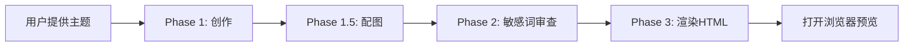

# 微信公众号文章生成器 Skill

// turbo-all

## 触发方式

**推荐用法**：直接告诉我主题，我会一站式完成全部流程。

```
写一篇关于 [主题] 的公众号文章
```

**示例**：
- "写一篇关于 Claude 4 发布的公众号文章"
- "帮我写一篇介绍 Prompt Engineering 的微信文章"

---

## 智能流水线

本 Skill 采用 **端到端智能流水线**，用户只需提供主题，我会依次完成：



**无需任何中间确认**，全流程智能执行。

---

## Phase 1: 内容创作

1. **加载角色**：读取 `persona/tech_fast_food.md` 激活"科技速食"写作人设
2. **执行写作**：严格遵循角色设定中的写作风格和内容结构模板
3. **标注配图**：在需要插图处写入占位符：``
4. **保存文件**：输出 `{主题}_article.md`

---

## Phase 1.5: 智能配图

1. **扫描占位符**：识别所有 `` 形式的图片标记
2. **生成图片**：调用 Gemini Image API（需 `.env` 配置 `GOOGLE_API_KEY`）
   - Prompt 策略：`"现代极简插画风格, Morandi colors, 适合公众号配图, {描述}"`
   - 执行命令：`uv run python scripts/generate_image.py --prompt "{描述}" --output images/{文件名}.png`
3. **替换链接**：将生成的图片路径写回 Markdown

> **回退**：当 API 不可用时，可使用内置 `generate_image` 工具作为替代方案

---

## Phase 2: 敏感词审查 🔍

在渲染 HTML 前，扫描文章内容，检测并替换公众号敏感词：

### 敏感词清单

| 敏感词 | 推荐替换 |
|--------|----------|
| 自动化 | 智能联动 / 智能执行 |
| 股票 | 权益资产 / 投资标的 |
| 炒股 | 投资理财 |
| 赚钱 | 获取收益 / 创造价值 |
| 暴富 | 财富增长 |
| 割韭菜 | 信息差套利 |
| 翻墙 | 跨境访问 |
| VPN | 加速工具 |
| 币圈 | 数字资产领域 |
| 挖矿 | 算力贡献 |
| 微信 | 平台 / 生态 |
| 公众号 | 订阅平台 / 内容平台 |
| 抖音 | 短视频平台 |
| 小红书 | 种草平台 |

### 审查流程

1. **全文扫描**：使用正则匹配上述敏感词
2. **智能替换**：根据上下文选择最合适的替换词
3. **人工复核**：输出替换日志供作者确认

> ⚠️ 敏感词清单会持续更新，如遇新的限流词，请告知以便补充

---

## Phase 3: HTML 渲染

```bash
uv run python .claude/skills/wechat-article-generator/scripts/md_to_html.py {文件名}.md --preview
```

执行上述命令，生成精美 HTML 。

### 渲染特性

- 📱 移动端优先布局
- 🎨 微信公众号风格排版
- 🖼️ 图片转 base64 内嵌
- 📋 一键复制按钮，直接粘贴到微信编辑器

---

## 注意事项

- 文章长度：1500-3000 字（5-8 分钟阅读）
- 结构：每个板块 2-4 个小标题
- 文末三件套：金句收尾 + 下期预告 + 互动引导
- 敏感词：发布前务必通过 Phase 2 审查

